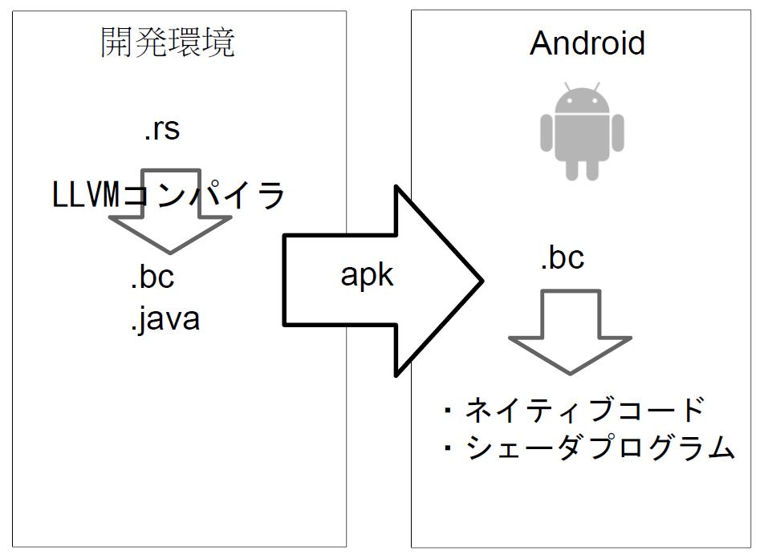

# RenderScriptでサクサク動くAndroidアプリを

　はじめまして，binzumeです．普段は趣味でAndroidアプリ開発したり，仕事でWebサービスを作ったりしています．筆者はもう3年くらいAndroidを触っていますが，OSのバージョンアップのたびに出来ることが広がっていくのが開発者として嬉しいですね．

　今回はRenderScript [^1] について書きたいと思います．Androidの数ある機能のなかでも，なんか凄そうなわりに使ってるアプリをあまり見かけないので，実際のアプリ開発で使ってみてどうだったかとかを書くので参考にしてもらえればと思います．

　想定読者は，Androidアプリを開発していて，速度が重要な処理をしたいけどNDKは面倒だなーと感じていて，RenderScriptをまだ使ったことがなくて，ターゲット端末をAndroid 4.0以降にしてしまっても良いと考えている人です．そんな稀有な人をターゲットにした内容ですが，それ以外の人も読めば雰囲気を感じてもらえると嬉しいなと思いながら説明していきます．

[^1]: http://developer.android.com/guide/topics/renderscript/index.html

## RenderScript

　RenderScriptはHoneycomb(Android 3.0)で導入された，デバイスに依存せずにネイティブコードを実行する仕組みです．実際にはそれ以前から内部的には使われていましたが，アプリから使うためのAPIが整備されました．これにより，Javaで書いたコードより高速に，かつNDKと違いデバイスのCPUに依存しないコードを利用することが出来ます．

　RenderScriptそのものは，新しい技術というわけではありませんが，今までサポート端末が少ないこともあって積極的に使いたい場面があまりありませんでした．この文章を書いている時期になってようやくAndroid 4.x世代の端末が半数を超え，使えそうな場面がやっと出てきたといった段階でしょうか．端末ごとにOSのバージョンアップの時期が異なり，新しいAPIをどのタイミングで使い始めるか考えないといけないのがAndroidアプリ開発の悩ましいところですね．この点はiPhoneがうらやましいところです．

　ちなみに今回はAndroidのアプリ開発の基本的な話などは省きます．ご了承ください． [^2]

[^2]: アプリ開発を始めたい場合はAndroid Deveropersへhttp://developer.android.com/


### NDKとの比較

　Androidアプリの大部分はJavaで開発していると思いますが，画像処理や，動画や音声など，どうしても高速な処理が必要な場合，NDKを使ってネイティブで実行されるライブラリを開発する必要が出てくると思います．そして，

　**NDK開発めんどうくさい...**

ですね．

　NDKも要は普通のシェアドライブラリ(.so)をJNI経由で呼び出しているだけなので．逆に言えば，何でもできるし，既存のライブラリを使いまわせるという利点はありますが．CPU単位でバイナリが分かれるので，動作確認も面倒ですしapkも大きくなりがちです(国内で販売されている端末のほとんどはARMなので，それだけに絞ってしまえば少し楽はできます)

　以下にRenderScriptの良いとこ，不便なとこを簡単にまとめてみます．


### 良いところ

- 高速：利用可能であればGPUやARMのNEON命令を用いたコードに変換されます
- デバイス非依存：NDKはCPUごとのバイナリをapkに含める必要がありますが，RenderScriptは１バイナリで良い
- ビルドが楽：ソースファイルを置いておけばSDKのツールが勝手にビルドしてよしなにapkに突っ込んでくれます


### 不便なところ

- 言語がC：アプリに２種類の言語が混在してしまう(NDKも同じ)
- 自由度が低い：ネットワークやファイルにアクセスしたりするAPIも用意されてないです
- 発展途上なのでバージョンごとに機能に差がある
- 良いデバッガが無い：現状だとデバッグ時に不便

　基本的には，高速実行のための工夫は実行する端末に任せて細かいこと気にしないで書ける，というのが良いです．ある程度規模が大きかったり，既存のライブラリに依存する場合は，今までどおりNDKで開発するのが良いと思います．


## 仕組み

　RenderScriptはC言語で書かれたソース(.rs)ファイルから，LLVM用のビットコードにコンパイルし，Android上でネイティブコードに変換されて実行されます．通常は意識する必要ありませんが，Android SDKに含まれるllvm-rs-ccがコンパイラです．普通のLLVMのclangコンパイラとの違い，ビットコードのほかにjavaからCの関数をメソッドとして呼び出すためのコードも生成します．

　apkにはコンパイル済みのLLVMのビットコード(.bc)がリソースとして含まれ，各端末上でさらに実行形式に変換されます．



　ビットコードがどんな方法で実行されるかは端末次第ですが，Galaxy NexusやNexus 7で試した限りでは，CPUで実行するための標準的なELFなオブジェクトファイル(.o)とGPUで処理できる部分はOpenGL ESのフラグメントシェーダが生成されているようです．

　また，決められたルールでLLVMのビットコードさえ生成できれば他の言語で書くことも可能そうです．今回は出来ませんでしたが，今後実験してみたいと思います．


## 歴史

　RenderScriptはその名前の通り，グラフィクスを高速に描画する機能を持っています．ただし，描画周りの機能は注意が必要でAndroidの世代によって利用できる機能の差が大きく，また現時点での最新バージョンであるJerryBeans(Android 4.1)になって，それまであった描画命令のほとんどが「deprecated(非推奨)」になっています．

　描画周りの変更点を辿ってみると．．．

- Honeycomb(3.x)世代： RenderScriptが利用可能になった．描画はSurfaceViewを継承したRSSurfaceViewに対して行う．
- ICS(4.0)世代： RSTextureViewに描画できるようになった．SurfaceViewと違い，普通のViewと同じように扱えるので便利．
- JerryBeans(4.1,4.2)世代： ほとんどすべての描画命令に加え，RSSurfaceViewとRSTextureViewがdeprecated(非推奨)に．そしてAllocationでSurfaceを扱えるようになった．

　最初から利用できたSurfaceViewは独自のWindowとSurfaceを持っているため，他のViewと一緒に扱うとなかなか言うことを聞いてくれない問題児でした．ICSで比較的素直なTextureViewに描画できるようになり実用的になったか？と思ったのですが，なんと次のバージョン(4.1)でもう非推奨扱いになっていました．

　このあとで書きますが，RenderScriptはグラフィックの描画だけでなく，処理を高速に実行したい場合に汎用的に利用できます．むしろ今後はそちらの用途に適したAPIなどが充実していくようです．


## RenderScriptを使ってみる

　javaのソースと同じようにRenderScriptのソースファイル(.rs)をおいて置けばAndroidのツールチェインが勝手にコンパイルしてくれて，アプリのresディレクトリ下にLLVMのビットコード(.bcファイル)が生成されるので楽ちんです．


### Eclipse+ADTでとりあえず使う

　Eclipse+ADTで開発している場合は，特に準備は必要ありません．Javaのソースコードと一緒にRenderScriptのソース(.rsファイル)を書いて終わりです．あとは自動的にコンパイル済みのbcファイルと，それを呼び出すためのクラスが生成されます．他の開発環境を使っている場合も大丈夫だと思います．

　まずは，以下のようなコードをhello.rsという名前で，適当なパッケージ下に書いてみます．

```
#pragma version(1)
#pragma rs java_package_name(net.binzume.android.rssample)

int \*result;

void hello(int a, int b) {
        \*result = a + b;
        rsDebug("Hello, RenderScript! ", a+b);
}
```

　文法はCですが，いくつか見慣れないものが出てきます．まずプリプロセッサのpragma命令でRenderScriptのコンパイルに必要な情報を記述します．

　「version」は今のところ1固定です．「rs java\_package\_name」はJavaのスタブクラスが作られるパッケージで，rsファイルもこのパッケージのディレクトリに配置しておきましょう．

　rsDebug()はrs_debug.rshというヘッダファイルで宣言されている関数で，ログを出力します．logcatで見れるので，いわゆるprintfデバッグをするときにお世話になります．

　このrsファイルを保存すると，ScriptC_helloというjavaのクラスが生成されるはずです．

　適当な場所に以下のようなメソッドを書いて，先ほどのhello()を呼び出してみます．

```
import android.renderscript.*;
import android.util.Log;
// ～省略～
  private void executeRS() {
    RenderScript rs = RenderScript.create(getApplicationContext());
    ScriptC_hello hello = new ScriptC_hello(rs,getResources(),R.raw.hello);
    Allocation result = Allocation.createSized(rs, Element.I32(rs), 1);
    hello.bind_result(result);

    hello.invoke_hello(123, 456);

    int resultArray[] = new int[1];
    result.copyTo(resultArray);
    Log.d("SampleApp","executeRS result: " + resultArray[0]);

    rs.destroy();
  }
// ～省略～
```

　2つの整数の和が計算できましたやったー．実行するとログに「Hello, RenderScript! 579」と「executeRS result: 579」という出力が見つかるはずです．

　ちなみにRenderScriptのインスタンスを作る時間を入れると数十msかかります．なのである程度重たい処理をしないと使う意味はないですね．

　実行結果を受け取るためにAllocationというものを使っています．これくらいだと関数の戻り値として受け取れないのが少し不便に感じますが，RenderScriptは同期的に実行されるとは限らずinvoke_hello()を呼んだ段階ではまだ処理が完了していない可能性があるので戻り値は使えません．また，同じメモリ空間やCPUで実行される保証もないので直接のアクセスは出来ず常にAllocation経由になります．例外として，関数を呼ぶ時の引数とグローバル変数に値を渡す場合は自動生成されたメソッドを使うことができます．

　Allocationは実際にはOpenGLのテクスチャメモリが割り当てられたりもするようです．


## RenderScriptの機能

　C言語で記述できますが，先ほど見たようにコードの雰囲気は普通のプログラムと大分かわっています．

　数値型についても，よりGPUに対する最適化などを行いやすくするためであろうfloat2～4等のベクトルや行列型などが標準で用意されています．これらの型は構造体ではなく，clangコンパイラのattribute属性を用いて上手いことやっているようです．詳しくはAndroid SDKのリファレンスを参照してください．


### Compute and Graphics

　RenderScriptの機能は大きく分けてComputeとGraphicsという2つの用途のためのものに分かれます．

　Computeは計算を高速に行うためのもので，並列実行用の仕組みが用意されています． たとえば並列に実行できるループなどは用意されているrsForEach()関数などを使って実装すると，最適化が効きやすくなります．

　Graphicsは毎フレーム画面を更新するような用途に使います．OpenGLに似た命令セットを用いて描画を行います．Graphicsの方の使い方は，今後あまり活用する場面が無さそうなので今回は割愛します．


## RenderScriptを使っているアプリ

　Play Booksアプリのページめくり時の効果や，YouTubeアプリのタブレット版のカルーセルビューなどで使われているようです．また，Androidに標準で入っているLiveWallPaperもRenderScriptで表示していて，ソースもAndroidのソースツリーに含まれているので，どう実装されているか参考にするのも良いと思います．

　あと宣伝ですが，拙作の「自炊本リーダー(仮) [^3] 」というアプリでも画像処理にRenderScriptを使ってます．色々不完全ですが，作った時点では巷にある同じようなアプリの中では一番軽快に動作するようになりました(その時点で見つけたアプリの中ではですが)

[^3]: https://play.google.com/store/apps/details?id=net.binzume.android.bookreader


## 実行速度

　ここではRenderScriptの処理速度を計測してみます．ベンチマーク用の処理としてビットマップの各ピクセルの座標に対して線形変換を施して画像を変形させる処理を考えます．

```
rs_script script;
rs_allocation inBuffer;
rs_allocation outBuffer;
float2 center;

void root(uchar4 * v_out, uint32_t x, uint32_t y) {
    float2 pos = {x, y};
    float theta = length(pos - center) / 1000.0;
    rs_matrix2x2 m = {cos(theta),-sin(theta),sin(theta),cos(theta)};
    float2 p = rsMatrixMultiply(&m,pos);
    * v_out = * (uchar4*)rsGetElementAt(inBuffer, p.x, p.y);
}
```

　与えられた中心点を基準に，グニャっと曲げます．計算はてきとうです．rootという関数名はrsForEach()経由で呼び出す都合です．

　この処理をHD画質(1280x720)のビットマップの各ピクセルに対して行ってみます．

|          | Java | RS(1) | RS(2) |
|----------|------|-------|-------|
| 実行時間 | 561  | 127   | 280   |

　数値は処理にかかった時間ms(ミリ秒)で，10回実行した平均値です．

　「Java」は同等の処理をJavaで実装してdalvik上で実行した場合の処理時間です．「RS(1)」は先ほどのRenderScriptコードをrsForEach()を使って呼び出した場合で，「RS(2)」は同じ時処理を普通のforループで回した場合の時間です．

　単純にRenderScriptで書いたものはJavaで書いたものの2倍程度，並列処理できればさらに2倍以上の速度で処理ができることがわかります．このあたりは，オーバーヘッドの時間もあるので，細かいデータを色々なパターンで処理したい場合には向きませんが，同じような処理を繰り返す場合はRenderScriptを使うとパフォーマンスの改善が期待できます．


## ハマりどころ

　RenderScriptを使いはじめる前に，気をつけたほうが良い点がいくつかあります．


### デバッグしやすい実装に

　JavaじゃないのでException飛んできてスタックトレース表示，というわけにはいきません，かといって良いデバッガが用意されているわけでもないので複雑な処理をする場合は処理を分割してJava側で結果が正しいかテストできるように書くのが良いです．あと，rsDebug()関数でログ出力ができるので活用しましょう．printfデバッグ最強(ぇ．


### パフォーマンス悪化を防ぐ

　RenderScriptのインスタンスは生成にある程度時間がかかるので，処理のたびにつくるのではなく，可能ならば事前に生成しておき，用済みになってから破棄するのが望ましいです．ただし，RenderScript内部では専用のスレッドが生成されているので，破棄し忘れるとスレッドが残ってしまい，スレッドがリークしてしまうので他のリソース以上に気をつける必要があります．

　また，データはAllocationを経由してやりとりするので，どうしてもオーバーヘッドが発生します．小さいデータを頻繁にやりとりしなければいけない等でNDKを使う方が良い場合も多いでしょう．


### 将来を見越して使おう

　歴史の項でも触れたとおり，Honeycombで導入されてから，バージョンアップのたびに推奨されるグラフィックの描画の方法が変わっています．特にJerryBeansになってRenderScriptの方針は大きく変わりました．とはいえ，この記事を書いている時点ではICS(Android 4.0)を搭載した端末の割合のほうが高いので，どうしても無視はできません．

　となると，RSSurfaceViewか，ICSで導入されたRSTextureViewを使うことになりますが，SurfaceViewは他のViewと挙動が違い扱いにくいので，どうしてもHoneycombをサポートしたい場合以外は，RSTextureViewを使うのがオススメです．ゲーム等，SurfaceView一枚ですべて済ませる場合は，どちらを選んでもあまり実装に変わらないので，Honeycombサポートしたいか，なるべく新しいAPI使いたいかで決めれば良いでしょう．

　描画命令は今後も使えますが，高度な描画命令が必要な場合は素直にOpenGL等を使うべきです．RenderScriptでグラフィックスを描画する場合は，TextureViewを単なるフレームバッファとして扱い，将来的にはAllocationで割り当てたSurfaceを使うようにすることを考えるのがよさそうです．

　JerryBeansになってからは，高速化や便利な関数の追加などが主な変更点になってきているので，これ以上は大きく変わらないと信じたいですね．


## まとめ

　今あるAndroid端末の半数以上，今後発売されるもののほぼ全てがRenderScriptに対応しているはずなので，使ってみる価値はあると思います．Google Chromeのdev-channelにもLLVMのコードを実行するPNaClが入りましたし，GoogleはLLVMを積極的に使っていこうという姿勢がうかがえます．今後もLLVM界隈は目が離せないですね．

　今回使ったコード類はGitHubのリポジトリ [^4] で公開していますので，興味を持った方はそちらもご覧ください．

[^4]: https://github.com/binzume/c84-android-renderscript
