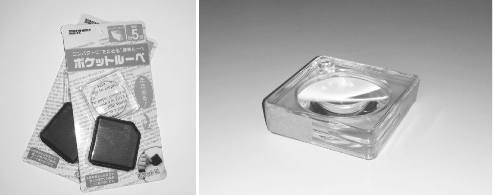
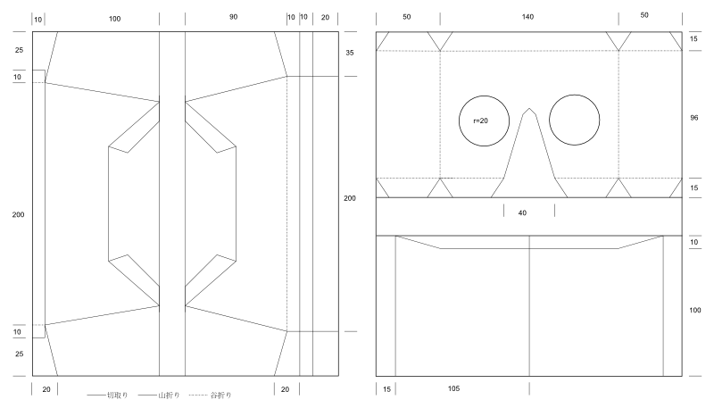
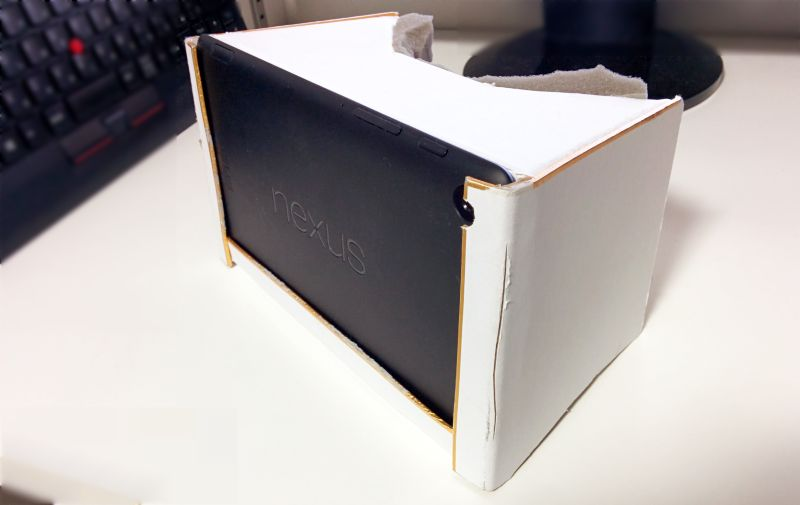
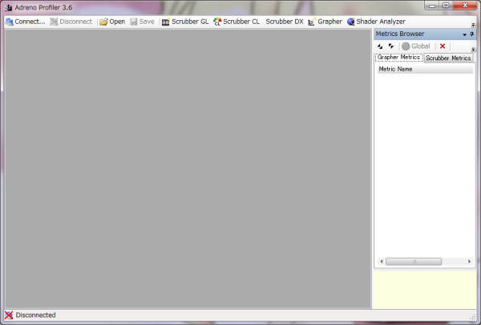
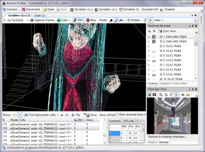

# 525円とNexus 7で"Oculus Rifts7"

　こんにちは、趣味でAndroidアプリを作ったり、電子工作したり、仕事でWebサービス作ったりしている binzume です。前回、AndroidのRenderScriptの話を書かせてもらったので、またAndroidネタで何か書こうと考えていました。

　今回は、100円ショップで買った材料でOculus Riftを作った話を書こうと思います。Androidネタのつもりでしたが、あまりAndroidと関係ない内容になってしまいました。Android 4.4(KitKat)で導入されたARTとLLVMの話とかも書きたかったのですが、機会と時間とやる気があればそのときに．．．

## Oculus Rift

　Oculus Rift [^1] とは Oculus VR 社が開発したバーチャルリアリティ用のHMD(ヘッドマウントディスプレイ)です。
これまでに販売された一般的なHMDと大きく違うのは、110度という大きな視野角を持っていることと、加速度センサやジャイロなどが内蔵されて装着者の頭の方向をトラッキングできることです。そのため、高い没入感が得られます。センサーを使ったりするためには、アプリケーションがOculus Rift に対応している必要があります。

　またSDKも公開されているので、だれでも Oclus Rift 対応のアプリケーションを開発することができます。実際に多くの人が Oculus Rift 対応のアプリケーションを作って公開しています。

　一言で言うと革命です。Oculusの凄さは体験しないとわからないので、もし身近にOculus Riftを持っている人がいたら見せてもらいましょう。

## "Oculus7"を自作しよう！

　ある日、友人のOculus Riftで遊んでいたのですが、本格的に遊びたくなったので欲しくなりました。

　普通に買っても良かったのですが、少し不満もあります。

-   PCが必要。ケーブルも邪魔
-   HD版が出るらしいけどいつ出るんだろう...今すぐ欲しい！
-   Nexus7とレンズさえあれば自作できそう

　というわけで、Nexus7でOculus Riftもどき,もといOculus7を作ります。命名は適当です。商標的に怪しいかもしれませんが、とりあえず販売したりしないので許してください。

## ハードを作る

　電子工作とか難しいことはしないです。小学生の自由工作的なノリで作っていきましょう。

　最初は3Dプリンタで格好良いボディを作ろうかとか、レンズはどんなものが適しているのかとかとか考えていたのですが、まずはすぐ入手できそうな材料だけで作ってみることにします。

### 材料

　Nexus7以外は100円ショップで揃います。

|         | 個数 | 備考    | 単価 | お値段 |
|---------|------|---------|------|--------|
| ルーペ  | 4    | 倍率5倍 | \105 | \420   |
| 色紙    | 1    | 2枚入り | \105 | \105   |
| Nexus 7 | 1    | 2013ver | ---  | ---    |
| 計      |||| Nexus7 + ￥525  |

　ルーペについては、この後の説明を読んで貰えれば、選ぶときの参考になると思います。あとは必須ではないですが、両面テープ付きのスポンジがあると良いです。ドアの隙間とかに貼るアレです。

### あると良い道具

　組み立てるための道具がなければ、購入しましょう。こちらも、100円ショップで揃います。

-   カッターナイフ、デザインナイフ
-   定規、三角定規、コンパス
-   筆記用具
-   両面テープ

　細かい箇所があるので、カッターナイフだけでなくデザインナイフがあると良いです。色紙上に図面を書き写すために、定規、コンパスと筆記用具が必要です。両面テープは、できるだけ薄くて強力なものを用意してください。

### レンズ

　制作する上でレンズの入手が一番の問題だと思います。Oculus Riftで使われているレンズは、計測したわけではありませんが焦点距離40mmくらいの球面レンズのようです。しかし、ちゃんとしたレンズはそれなりのお値段ですし、注文するのも面倒です。そこでとりあえず難しいことは考えず、すぐ入手できる安いレンズを考えたところ、100円ショップで売っている虫眼鏡に思い当たりました。

　ルーペの倍率(から1を引いた値)は焦点距離と反比例の関係にあります。具体的に倍率(N)と焦点距離(f)の関係は、

> N = (250 / f ) + 1

　と計算するのが一般的なようです。

　レンズとスクリーンの距離は40～50mm程度にしたいので、6～7倍のルーペを買えば良いはずです。と、まあ計算はできますが、都合の良い倍率のルーペはなかなかありません。一般的なルーペの倍率は3～5倍程度で、10倍以上のものもありますが、高価な上レンズの直径が小さいものがほとんどです。なので、精度とか品質とかはいったん気にしない方向で試行錯誤してみました。



　写真は、100円ショップのセリアで買ってきた「ポケットルーペ(株式会社グリーンオーナメント)」です。何種類か買ってきて試しましたが、このレンズ部分を2枚重ねて使うことにしました。当初は1枚で大丈夫かと考えていたのですが、焦点距離が想定より長くてダメでした。この製品は四角い枠が付いているので重ねて使うにはちょうどよいですし、固定もしやすいです。

　2枚重ねたレンズを実際に覗いてみると、レンズの中央付近は問題ありませんが周囲の方は、像のエッジが虹色に滲んで見えます。
これは色収差と言って、同じレンズでも光の波長によって屈折率が違い、色によって像にズレが生じるために起こります。
カメラ等では、材質や形状の違うレンズを複数枚重ねることで色収差の影響を除去したりするのですが、今回は2枚ともプラスチックのレンズなのでどうしても影響が出てしまいます。とはいえ、視野の中心付近だけちゃんと見えていれば、あまり気にならないので問題ないでしょう。

### ボディを組み立てる

　ボディの制作には色紙(240x270mm)を2枚使います。色紙でなくともある程度硬い素材ならばなんでも大丈夫です。
お金に余裕があればPVCのシートなどで作るのも良さそうですね。
左右のレンズの中心の距離は65mmくらい。レンズとスクリーンの間が40～50mm。このあたりさえ上手く調節すればボディはどう作っても良いので、あなただけのオリジナルのOculus7を作ってあげてください(決して細かい説明をするのがめんどうだとか、原稿の締め切りに追われて書いている時間がないとかではありません)。



　図面通りに切り抜いて、両面テープで貼り合わせれば出来上がりです。色紙の紙が厚いので綺麗に折り曲げるのが少しむずかしいかもしれません。折り曲げる前に、折り曲げ線に定規などで強めに跡をつけておくか、少し出来上がりの見栄えが悪くなりますが、折り曲げる箇所にカッターナイフで切れ目を入れておくと楽に折り曲げられます。

　レンズは2枚重ねてテープで止め、ボディには両面テープで固定します。



　隙間があると外界の光が入って気になるので、ドアの隙間に貼ったりするスポンジ付きのテープを切って貼りましょう。
あと、Nexus7は差し込んだだけで固定されないので、真上を見たりして落としたりしないように注意してください。


## ソフトを作る

　ハードは出来上がりましたが、Oculus7を楽しもうにもソフトがありません。
まずは、YouTubeなどを探すと、Oculus Rift用に出力された動画があるとおもうのでそれを見てみるのも良いです。レンズが別物なので完全に再現はできませし、動画なのでヘッドトラッキングもされませんが、かなり雰囲気は味わえます。

　Nexus7にはせっかく加速度センサとジャイロが載っているので、Oculus
Rift用のアプリケーションのように頭の動きに追従してレンダリング結果に反映させたいですね。

　というわけで、Androidアプリを作ります。

### シェーダ

　まず、そのまま表示してもOculus7でまともに見れませんし、とりあえず左右2分割にすれば見ることはできますが、歪んで見えてしまいます。Oculus7向けに描画しないといけません。

　レンズの特性に合わせて、出力する映像を加工します。
手段は色々ありそうですが、OpenGLで描画するつもりなので、画像処理もフラグメントシェーダでやってしまうのがよさそうです。
たぶん、本家Oculus RiftのSDKも似たようなことをしてます。

　100円ショップで買ったレンズの詳細な特性とかわからないし、面倒な計算もしたくないので、適当に様子を見ながら調整していきます。

```
precision highp float;
varying vec2 vTexCoord;
uniform sampler2D sTex1;
uniform sampler2D sTex2;
const float scaleR = 0.9;
const float dx = -0.032;
const float renderAspect = 9.0 / 7.0;
const float texAspect = 1.0;

vec2 calcTexCoord(vec2 texCoord) {
  vec2 scale_factor = vec2(scaleR * 2.0,scaleR * renderAspect);
  vec2 d = ( texCoord - vec2(0.25,0.5) ) * scale_factor;
  float dd = d.x * d.x + d.y*d.y;
  vec2 t1 = d * (0.8 + 1.20 * dd + 2.00 * dd*dd);
  return t1 * vec2(1.0,1.0) + vec2(0.5,0.5);
}

void main(){
  vec2 tc = calcTexCoord(vTexCoord -
      (vTexCoord.s < 0.5 ? vec2(-dx,0.0): vec2(0.5 + dx,0.0)));
  if (tc.x < 0.0 || tc.y < 0.0 || tc.x > 1.0 || tc.y > 1.0) {
    gl_FragColor = vec4(0.0,0.0,0.1,1.0);
  } else if (vTexCoord.s < 0.5) {
    gl_FragColor = texture2D(sTex1,tc);
  } else {
    gl_FragColor = texture2D(sTex2,tc);
  }
}
```

　だいぶ手抜き実装です。事前にカメラのx座標をいじって、右目用画像と左目用画像レンダリングし、sTex1とsTex2に書き込んでおきます。1枚のポリゴンを2分割して、2枚のテクスチャを書き込みます。
calcTexCoord()関数で、画面上の座標とテクスチャ上の座標を変換しています。t1を求めるところで、各ピクセルについて、レンズの中心からの距離に応じた適当な係数の二次関数で変換をかけています。このパラメータはレンダリング結果を見ながら適当に調節しました。他にいくつか定数がありますが、dxが左右のレンズの中心の距離を調節するためのもので、scaleRは描画時の全拡大率の逆数です。

### シェーダのデバッグ

　OpenGLを使う処理のデバッグするとは、エラーの内容から何が起きたのかを検討をつけて直すのは地味に手間がかかります。
こういうとき、どのFBOのレンダリングに失敗しているのかとか、テクスチャちゃんと読み込めているのかとかがわかると嬉しいですね。

　GPUのチップメーカーがAndroidで使えるプロファイラを出していてくれたりするので活用しましょう。
Androidでよく使われる、NVIDIAのTegraやQualcommのAdrenoなら、無料で提供されています。
すべてのGPU向けのものが無償で使えるわけではありませんが、上記のGPUを搭載した端末を利用しているならばぜひ使いましょう。

　Nexus7(2012)のGPUはTegra 3が載ってたのでNVIDIAのPerfHUD ES [^2] が使えますし、2013年モデルは、Qualcommなので、Adreno Profiler [^3] が使えます。 残念ながらWindows版しかありません。Macしか持っていない人は、いますぐLenovoショップに行ってThinkPadを買うと良いです。

　ここでは、Adreno Profilerを例に説明します。 詳細はAdreno Profilerのリファレンスを参照するとして、ざっくりと。

　まず、標準では端末側でGPUのデバッグが無効になっているのでadbを使って有効にします。

> adb shell setprop debug.egl.profiler 1

　1 にセットすると有効になり、0にすると無効になります。Androidを再起動すると初期値に戻るので、デバッグする前に実行しましょう。

　Adreno Profilerを立ち上げると以下の様なウインドウが表示されます。



　Connectボタンを押して、Scrubber GLを選べば描画しているデータを見たりできます。

　フレームをキャプチャすると、そのフレームのレンダリングに使った全データがPC上に取り込まれます。
実行された命令ごとに、任意の地点でのテクスチャやFBOの状態などを表示できます。Adreno Profilerは、レンダリング結果をプレビューするためにAndroid端末上で実行された命令をPC上でエミュレートして再現するので、利用しているOpenGL ESの命令に対応しているグラフィックボードが必要です。最近のグラフィックボードであればおおむね大丈夫です。

　(記事を書いている途中で気づいたのですが、AndroidをKitKat(4.4)にアップデートするとAdreno
Profilerが使えなくなりました。 Adreno Profilerがアップデートされるか、解決方法が見つかるのを待ったほうが良いかもしれません)



　また、プロファイラというだけあってレンダリングのボトルネックを見つけるにも役立ちます。CPUコアやVRAMの使用率やテクスチャデータの転送帯域などグラフで見ることができるので便利です。

　今回はFPSが想定より低かったので調べてみたところ、テクスチャとして使っているFBOへのアクセスがボトルネックになっていました。対象のテクスチャの解像度を下げたり、レンズ越しに実際には見えない部分を描画しないように描画範囲を制限したところ、12fps程度しか出なかったものが30fpsに改善しました。このあたりは、試行錯誤で調整するのはとても手間がかかるので、プロファイラがあるのと無いのでは、だいぶ違います。

### ジャイロと加速度センサとコンパス

　Nexus 7に搭載されているセンサを使って、端末の向きをトラッキングしてみます。これで、ようやくOculus7を名乗れそうです。

　加速度センサ、ジャイロ、地磁気コンパスあたりを使えばできそうですね。これらのセンサーを扱うAPIはAndroidに用意されてるので、SDKのリファレンスでSensorManagerあたりを読みましょう。

　AndroidのAPIには SensorManager.getRotationMatrix()という、加速度センサと地磁気コンパスの値から、回転行列を求めてくれる便利関数がありますが、ジャイロの値を使ってくれません。

　試しにgetRotationMatrix()で求めた値を観察してみると、その瞬間の加速度センサで得られた加速度だけで上下方向を決めているらしく、Oculusのように頭に装着することを考えると回転軸が端末上から外れ、どうしても遠心力によって生じる加速度が無視できません。

　とりあえず、ジャイロの値を無理やり入れるコードを書きます。角度を出すためには、ジャイロから得られる角速度を積分する必要があるので、一定間隔でセンサの値が取れるようにリスナを登録しておきます。

```
if(event.sensor.getType() == Sensor.TYPE_GYROSCOPE) {
  if (lastGyroTime > 0) {
    float dt = (event.timestamp - lastGyroTime) * 0.000000001f * 1.05f;
    // yaw rotation
    rotation[0] -= -Math.sin(rotation[2]) * Math.cos(rotation[1]) *
        event.values[0] * dt; // vY => Y
    rotation[2] += (Math.sin(rotation[1]) * event.values[0] -
        Math.cos(rotation[2]) * Math.abs(event.values[0])) * dt; // vY =>X
    rotation[1] -= Math.cos(rotation[2]) * event.values[0] * dt; // vY =>Z
    // pitch rotation
    rotation[2] += Math.cos(rotation[1]) * event.values[1] * dt; // vX
    rotation[0] += Math.sin(rotation[1]) * event.values[1] * dt; // vX =>Y
    // roll rotation
    rotation[1] += event.values[2] * dt; // vZ
  }
  lastGyroTime = event.timestamp;
}
```

　これもかなり手抜きの実装です。SensorEvent.timestampには、センサからの入力を取得したナノ秒単位の時間が入っているので、前回の値との差を取って前回のイベントからの経過時間(dt)を求めます。
　あとは、レンダリング時にカメラの回転をロール、ピッチ、ヨー方向の順序で回転しているので、順番に回転を適用してやります。完全な実装にすると式が長くて入力がめんどうだったので、普通の動作で値が大きくなりそうな項だけで実装しました。行列の形にすればもっと読みやすくてスマートな実装になりますが、一旦動くので良いでしょう。(と書いたのですが、イマイチなのでこれ書いた後に回転行列を掛けるように書き直しました。GitHubのコードを参照)

　あとは、ジャイロセンサーだけを見ていると誤差が蓄積していくので、加速度センサーとコンパスから得られた値で補正します。ついでにBluetoothキーボードやゲームパッドで動かせるようにしたりしました。ゲームパッドなどの操作で激しく動くと3D酔いが激しいです。

### MMDのモデルを表示

　ここまでで、Oculus7にOpenGLで3Dモデルをレンダリングする準備は整いました。いきなりゲームを作り始めたりするのも良いですが、まずはやっぱり、MMDのモデルを表示したくなります。初音ミクを目の前で踊らせて眺めたりしたいと99.9%くらいの人が思うはずです。

　いちから作るのは大変なので、既存のライブラリに頼りましょう。Androidで動作する実装としては、MikuMikuStudio [^4] ,MikuMikuDroid [^5] などがありました。

　モデルの読み込みもIKも物理演算もライブラリが解決してくれるので、上記のシェーダーやセンサー部分を実装するだけで簡単にOculus7対応になります。


　試しにモデルとモーションデータをダウンロードしてきて、初音ミクを踊らせてみました　[^6] 。

　デバッグ中、後ろや上を向くと何もない空間が広がっていてつまらない事に気づいたので、視線を動かした時の動作の中心点を自分の座標ではなく、ステージ中央の座標に固定するモードを付けました。説明では分かりにくいですが、正面を向いているときはミクさんと向い合っている状態で、下を向くと上から見下ろしている状態になります。会社に持っていてこの状態で何人かに体験してもらったのですが、どういうわけか99.9%くらいの人が上を向いていました。何が見えていたんでしょうか [^7] ？

　Oculusに無い機能としてNexus7にはカメラが付いているため、手のジェスチャーでメニューを操作とかできそうです。
　これは手を付けましたが時間がなくてカメラ画像をオーバーレイ表示したあたりで開発が止まっています。

## まとめ

　このネタを思いついたのは2013年の5月頃で、実際に作ってみたのは9月末です。
　数ヶ月間どう作るか考えていたのですが、結局休みの日に100円ショップに行ったら作れそうな気がしたので、半日で作ってしまいました。
　ハードができるとやる気が出るので、ソフトも翌日に一気に実装して、予想以上に満足できる結果が得られました。
　悩んでいないで、さっさと作ってしまうのが良いですね。そして100円ショップは素材の宝庫です。

　Oculus Riftもっと流行ると良いなと思っています。Oculus Riftはそれほど高価なものではありませんが、よほどのガジェット好きか一度体験してほしくならなければ、なかなか買わないでしょう。その点、Nexus7は普通にタブレットとして普及しているので、簡単に自作できるのは良いですね。とはいっても、それなりの手間がかかるのと、アプリケーションも専用のものになってしまっているのが今後の課題です。

　今回使った図面やコードは、GitHubのリポジトリ [^8] で公開する予定です。

[^1]: http://www.oculusvr.com

[^2]: https://developer.nvidia.com/nvidia-perfhud-es

[^3]: http://goo.gl/bDEhvx

[^4]: http://sourceforge.jp/projects/mikumikustudio/wiki/FrontPage

[^5]: http://sourceforge.jp/projects/mikumikudroid

[^6]: 今回、確認用に使わせていただいたモデルは、モデルはLat式ミクです。ミクは天使ですね！

[^7]: えっちなのはいけないと思います

[^8]: https://github.com/binzume/oculus7
